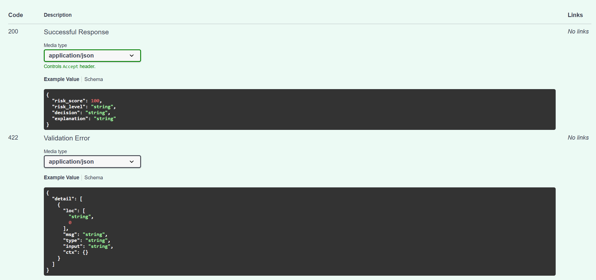
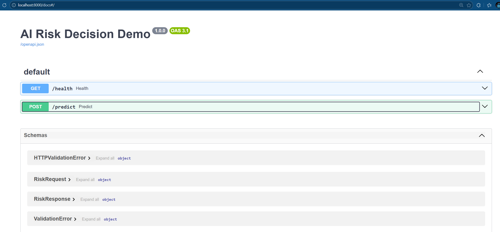
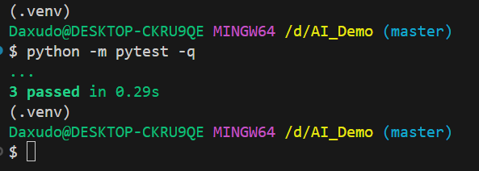
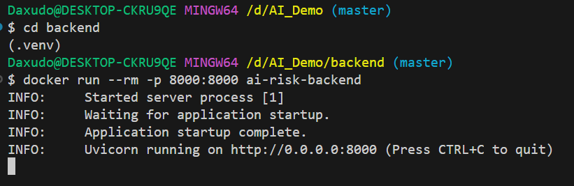

# AI Risk Decision Demo

Demo **full-stack** para **evaluación de riesgo crediticio**, orientado a la toma de decisiones de financiamiento (por ejemplo, créditos para vehículos).

El proyecto implementa un flujo completo **frontend + backend**:

- El **frontend** permite ingresar datos del solicitante.
- El **backend** evalúa el riesgo y devuelve:
  - puntaje de riesgo
  - nivel de riesgo
  - decisión
  - explicación trazable

## 🧠 Qué problema resuelve

En escenarios reales (financieras, automotrices, bancos), es necesario:
- evaluar riesgo de forma consistente
- validar datos de entrada
- devolver decisiones explicables
- exponer el modelo mediante una API confiable

Este proyecto simula ese flujo de punta a punta.

---

## 🧰 Stack tecnológico

- **Python 3.11**
- **FastAPI** – API REST, validación y OpenAPI
- **Pydantic** – schemas y validación de datos
- **Pytest** – testing automático
- **Docker** – contenedorización
- **Uvicorn** – ASGI server

### Frontend
- React
- Vite
- TypeScript
- Fetch API
- CSS (UI oscura)

---

## 🏗️ Arquitectura del proyecto

```

backend/
├─ app/
│   ├─ main.py        # Endpoints y wiring de la API
│   ├─ schemas.py     # Modelos de entrada/salida (Pydantic)
│   └─ service.py     # Lógica de negocio (modelo de riesgo)
├─ tests/
│   ├─ test_health.py
│   └─ test_predict.py
├─ requirements.txt
└─ Dockerfile

```

Separación clara de responsabilidades:
- **API** ≠ **lógica de negocio**
- Código testeable y escalable

---

## 🔌 Endpoints disponibles

### Healthcheck
```

GET /health

````

Respuesta:
```json
{
  "status": "ok"
}
````

---

### Evaluación de riesgo

```
POST /predict
```

#### Ejemplo de request

```json
{
  "age": 35,
  "monthly_income": 800000,
  "vehicle_price": 12000000,
  "down_payment": 6000000,
  "employment_years": 6
}
```

#### Ejemplo de response

```json
{
  "risk_score": 55,
  "risk_level": "MEDIUM",
  "decision": "Approve with conditions",
  "explanation": "financed_amount=6000000, ratio=1.25, employment_years=6, age=35"
}
```

La **explicación** permite auditar por qué se tomó la decisión.

---

## 📘 Documentación interactiva (Swagger)


FastAPI expone automáticamente OpenAPI.

* URL: [http://localhost:8000/docs](http://localhost:8000/docs)

(ideal para probar el endpoint y validar contratos)

---

## 🧪 Tests automáticos

Los tests cubren:

* healthcheck
* endpoint `/predict`
* validación de respuestas

Ejecutar tests:

```bash
python -m pytest -q
```

Resultado real del proyecto:



Esto demuestra que:

* el código es verificable
* los contratos funcionan
* la lógica responde correctamente

---

## 🐳 Docker

El backend está completamente dockerizado.

### Build de la imagen

```bash
cd backend
docker build -t ai-risk-backend .
```

### Ejecutar el contenedor

```bash
docker run --rm -p 8000:8000 ai-risk-backend
```

Salida esperada:

* servidor levantado
* escuchando en `0.0.0.0:8000`

Evidencia real:



Esto garantiza portabilidad y despliegue consistente.

---

## ⚙️ Decisiones técnicas

* **FastAPI** por tipado, performance y OpenAPI automático
* **Pydantic** para validación fuerte de datos de entrada
* **Separación de capas** para testear y escalar
* **Tests** como contrato del sistema
* **Docker** para estandarizar ejecución en cualquier entorno

---

## 🚀 Próximos pasos posibles

* Persistencia en base de datos
* Autenticación
* Versionado de modelos
* Métricas y observabilidad
* Integración con frontend

---
## 🎨 Interfaz de Usuario (Frontend)

El frontend está desarrollado con **React + Vite + TypeScript** y consume el endpoint
`POST /predict` del backend FastAPI.

Permite:
- Ingresar los datos del solicitante
- Enviar la evaluación al backend
- Visualizar puntaje, nivel de riesgo, decisión y explicación en castellano

---

### 📸 Capturas de pantalla

**Formulario de ingreso de datos:**


**Resultado de la evaluación:**


## 📌 Nota

Este proyecto es una **demo técnica**, pensada para mostrar:

* criterios de backend
* buenas prácticas
* capacidad de llevar un modelo de decisión a producción

